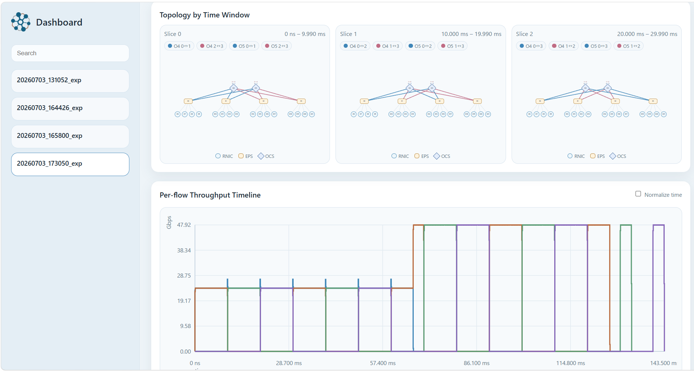

# NS3-MP-RDMA simulation

This is a MP-RDMA NS-3 simulator based on the [HPCC: https://hpcc-group.github.io/](https://hpcc-group.github.io/) implementation for simulating the performance of RDMA and MP-RDMA(Multi-Path RDMA) in reconfigurable optics networks (OCS).

## NS-3 simulation

The ns-3 simulation is under `simulation/`. Refer to the README.md under it for more details.

## Traffic generator

The traffic generator is under `traffic_gen/`. Refer to the README.md under it for more details.

## Dashboard


This repository includes a lightweight web dashboard for visualizing OCS/RDMA experiments.

```bash
python3 dashboard/run_serve.py --host 0.0.0.0 --port 8000
```

Then open:

```text
http://<server-ip>:8000
```

The dashboard dynamically scans:

```text
simulation/experiments/
```

and visualizes archived experiments.

The dashboard currently provides:

- experiment index
- topology by OCS time window
- OCS schedule / fixed map visualization
- flow and FCT result table
- per-flow throughput timeline support
- OCS forwarding/drop statistics
- RNIC injection window table
- CC mode / OCS mode / host count / EPS count / OCS count summary

The dashboard does not require a manually maintained JSON index. Experiment metadata is generated dynamically by `dashboard/run_serve.py`.


## Analysis

HPCC provide a few analysis scripts under `analysis/` to view the packet-level events, and analyzing the fct in the same way as [HPCC](https://liyuliang001.github.io/publications/hpcc.pdf) Figure 11.
Refer to the README.md under it for more details.
